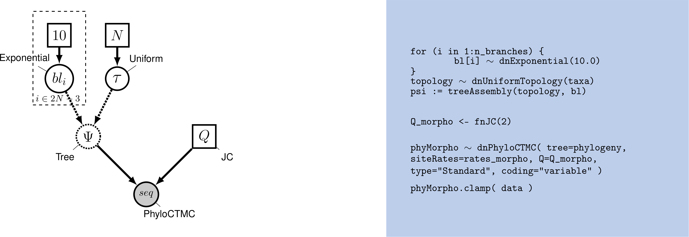
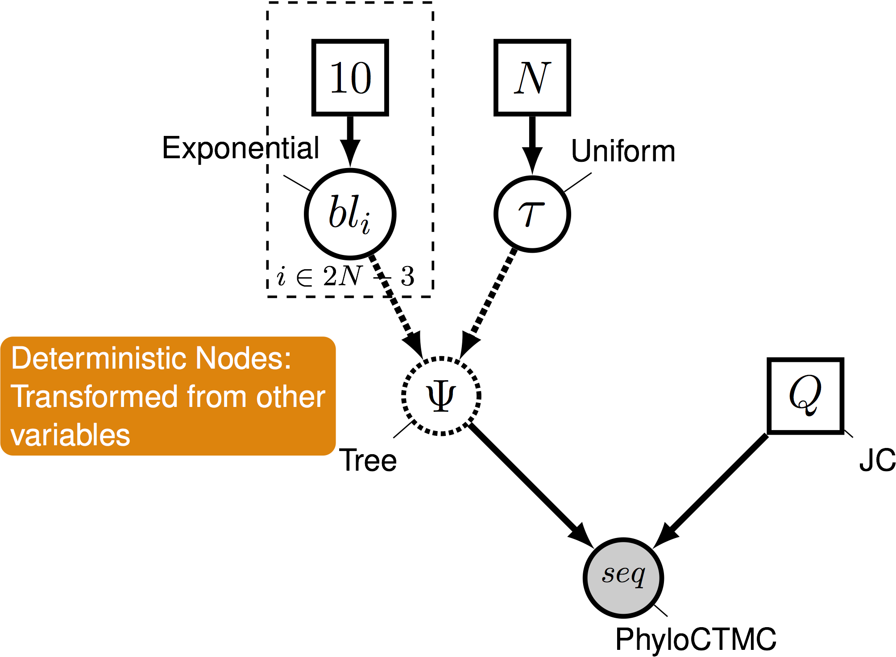

  Overview
----
- Introduction to Coding to Learn
- Introduction to graphical modeling
- How graphical modeling makes phylogenetic estimation more flexible
- Using RevBayes in the classroom


Learning to Code
-----

We're all familiar with the idea of learning to code

Learning to Code
-----

We're all familiar with the idea of learning to code 

> - Maybe students in your degree program take an upper-division course where codin is the aim

Learning to Code
-----

We're all familiar with the idea of learning to code 

> - Maybe students in your degree program take an upper-division course where codin is the aim
> - This is the "learn to code" framework. Being able to produce code is the end goal

Learning to Code
-----

There are some unsatisfying things about this model

Learning to Code
-----

There are some unsatisfying things about this model 

> - If we confine coding to niche classes, we're likely to miss much of the population 
> - Large proportion of students who seek out computational training have seen computation in high school

Learning to Code
-----

There are some unsatisfying things about this model 

> - If we confine coding to niche classes, we're likely to miss much of the population 
> - Large proportion of students who seek out computational training have seen computation in high school

== Confining learning to people who are already convinced of the utility


Learning to Code
-----

There are some unsatisfying things about this model 

> - If we confine coding to niche classes, we're likely to miss much of the population 
> - Large proportion of students who seek out computational training have seen computation in high school

== Students get coding either late in undergrad, or after they've been mucking around unproductively with data

Code to Learn
-----

Coding doesn't have to be the main focus of what you're doing. 

Code to Learn
-----

Coding doesn't have to be the main focus of what you're doing 

> - **Code to learn:** work with data computationally to develop biological insight 


Code to Learn
-----

Coding doesn't have to be the main focus of what you're doing 

> - **Code to learn:** work with data computationally to develop biological insight 

> - Example: Rather than talking about Bergmann's Rule, have students download occurrence data from GBIF and key it to a trait database to observe body size along longitudinal gradients

Code to Learn
------

Citations for many of the things in the previous couple slides can be found in [this](https://f1000research.com/articles/8-1854/v1#) manuscript


Code to Learn
-----

Coding doesn't have to be the main focus of what you're doing 

> - Systematics is a field ripe with opportunities 
> - To understand systematics, you need to know some 

> > - Biology 

> > - Statistics 

> > - Math 

> > - Geology & Earth history


Code to Learn
-----

Coding doesn't have to be the main focus of what you're doing 

> - Systematics is a field ripe with opportunities 
> - In performing systematics research, we learn about 

> > - Biology 

> > - Statistics 

> > - Math 

> > - Geology & Earth history

RevBayes 
----

RevBayes is a Bayesian modeling software underlain by a graphical model framework

RevBayes 
----

RevBayes is a Bayesian modeling software underlain by a graphical model framework 

> - RevBayes implements an R-like statistical modeling language called `Rev`

RevBayes 
----

RevBayes is a Bayesian modeling software underlain by a graphical model framework 

> - RevBayes implements an R-like statistical modeling language called `Rev` 
> - The design of the language is meant to give users control over the details of their analysis


The Graphical Modeling Framework
----

- What is a model?

The Graphical Modeling Framework
----
- What is a model?
  + A model uses mathematics to describe a process, or the behavior of a system
  + Important facets of the generating process of the data are written down as parameters

The Graphical Modeling Framework
----
- What is a model?
  + A model uses mathematics to describe a process, or the behavior of a system
  + Important facets of the generating process of the data are written down as parameters

- A graphical model represents the relationships and dependencies between model paramters

A simple case
----

- An archer: Let's say the archer is a pretty good archer

A simple case 
----

```{r}
good_shots <- rnorm(n= 100, mean= 0, sd = 1)
hist(good_shots, main="Archer arrow shots",  xlab = "Inches from bullseye")
```


A simple case
----

- An archer: Let's say the archer is a pretty bad archer

A simple case
----
```{r}
bad_shots <- rnorm(n= 100, mean= 0, sd = 5)
hist(bad_shots, main="Archer arrow shots",  xlab = "Inches from bullseye")
```

A **not so** simple case
----

> - It's easy to describe a model where we are manipulating one parameter 

> - But we rarely have such a simple case when we're analysing biological data 

> - We're describing the mechanisms that generated our observed data 

  + In the case of a tree, this is the process of molecular or morphological evolution
  

A **not so** simple case
----

- This is where graphical models come in

A **not so** simple case
----

- This is where graphical models come in
- A **graphical model** represents the joint probability distribution as a graph

A **not so** simple case
----

- This is where graphical models come in
- A graphical model represents the joint probability distribution as a graph
- **Nodes** are variables. **Edges** represent dependencies between nodes.

A **not so** simple case
----
- This is where graphical models come in
- A graphical model represents the joint probability distribution as a graph
- **Nodes** are variables. **Edges** represent dependencies between nodes.


A **not so** simple case
----

- This is where graphical models come in
- A graphical model represents the joint probability distribution as a graph
- **Nodes** are variables. **Edges** represent dependencies between nodes.


A **not so** simple case
----

- This is where graphical models come in
- A graphical model represents the joint probability distribution as a graph
- **Nodes** are variables. **Edges** represent dependencies between nodes.


Pr( data | model )

A **not so** simple case
----


Phylogenetical Complexity
----
- This is where graphical models come in
- A graphical model represents the joint probability distribution as a graph
- **Nodes** are variables. **Edges** represent dependencies between nodes.


Phylogenetical complexity
----


Phylogenetical complexity
----


Phylogenetical complexity
----



Phylogenetical complexity
----


Phylogenetical complexity
----


Who cares about graphical modeling?
----

> - In previous iterations of software, you might have to email a developer and ask them to implement something  

- RevBayes' graphical model framework emphasizes flexibility

Who cares about graphical modeling?
----

Over the next two hours, we're going to make the case that this framework enables flexible, code-to-learn classrooms

