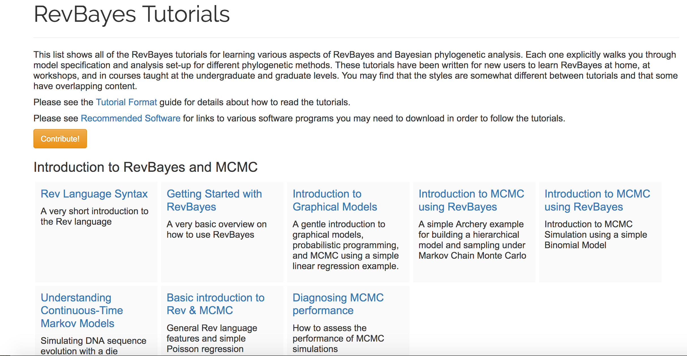

  
---  
  Overview
----

It would not be unfair to note that the cognitive load RevBayes is higher than other software

---  
  Overview
----

It would not be unfair to note that the **cognitive load** of RevBayes is higher than other software 

> - Amount of your working memory taken up by a task

---  
  Overview
----

In the next half hour, we'll take a look at some of the tools we have to allow RevBayes to fit in with your biology classroom 

> Tutorials
> RevNotebook, a Jupyter interface for RevBayes
> RevKnitr, an RStudio interface for RevBayes

---
Tutorials
-----



Tutorials
-----

> - Free to use
> - Markdown format 


Jupyter
------

> - Project Jupyter is a scientific computing non-profit 
> - They make the Jupyter Notebook (formerly iPython notebook)

Jupyter
------

Install instructions are here:

https://github.com/revbayes/revbayes_kernel

Jupyter
------

Tutorials can be converted to Notebook format with the tool `pandoc`
I keep a few examples here:

https://github.com/revbayes/RevNotebooks

RStudio
-------

```{r, eval=FALSE}

devtools::install("revbayes/RevKnitr")
```

